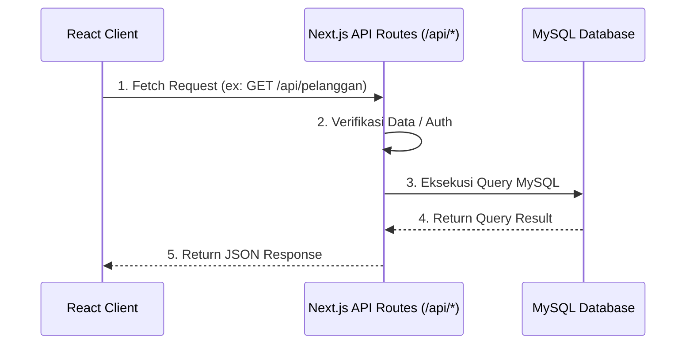

# Technical Documentation: PPOB Kasir PT. POS Indonesia

> [!NOTE]
> Dokumentasi ini merangkum aspek rekayasa (engineering), arsitektur, aturan pengkodean, sistem desain, keputusan desain, serta fitur-fitur dari proyek **PPOB Kasir - Next.js Version**.

---

## 1. Engineering (Rekayasa)

Proyek ini telah dimigrasi dari arsitektur terpisah (Vite + React + Express) menjadi satu kesatuan **Full-stack Next.js**.

### Technology Stack
- **Framework Utama:** Next.js 15 (App Router)
- **Frontend Library:** React 19
- **Bahasa Pemrograman:** TypeScript (Strict Type-Safe)
- **Styling:** Tailwind CSS & PostCSS
- **Database:** MySQL (dengan driver `mysql2`)
- **Iconography:** `lucide-react`
- **Payment Gateway:** `midtrans-client`

### Development Workflow
```bash
# Menjalankan Development Server (Port 3000)
npm run dev

# Melakukan Production Build
npm run build

# Menjalankan Production Server
npm start

# Menjalankan Linter
npm run lint
```

> [!WARNING]
> Kredensial koneksi database diatur melalui file environment `.env.local`. Pastikan file ini tidak ikut ter-commit ke dalam repository.

---

## 2. Architecture (Arsitektur)

Sistem menggunakan arsitektur **Full-stack Monolith** dengan memanfaatkan **Next.js App Router**. Dengan pendekatan ini, tidak ada lagi pemisahan port antara frontend dan backend.

### Struktur Direktori Utama
```text
ppob-kasir/
├── app/
│   ├── api/              # Backend API routes (Serverless Functions)
│   │   ├── health/       # Health check API
│   │   ├── pelanggan/    # CRUD Pelanggan
│   │   ├── petugas/      # Autentikasi / Data Petugas
│   │   └── transaksi/    # Proses Pembayaran
│   ├── globals.css       # Global styles Next.js
│   ├── layout.tsx        # Root layout (HTML wrapper)
│   └── page.tsx          # Halaman Utama (Home page)
├── components/           # Reusable React Components (Header, StatusBar, LoginForm, SearchForm)
├── lib/                  # Utilities dan Core Logic
│   ├── db.ts             # Koneksi Database MySQL
│   ├── types.ts          # Definisi TypeScript Interfaces/Types
│   └── utils.ts          # Helper functions (Format Rupiah, dll)
├── public/               # Static assets (Images, Fonts)
└── tailwind.config.ts    # Konfigurasi Tema Tailwind
```

### Arsitektur Data Flow



---

## 3. Coding Rules (Aturan Pengkodean)

1. **TypeScript First:** Semua komponen, utility, dan respon API harus memiliki tipe data yang jelas (didefinisikan dalam `lib/types.ts`). Hindari penggunaan tipe `any`.
2. **Komponen Fungsional:** Gunakan React Functional Components dengan hooks (`useState`, `useEffect`).
3. **Server vs Client Components:** 
   - Gunakan direktif `'use client'` secara eksplisit di awal file jika komponen memerlukan interaktivitas, React hooks, atau memanipulasi DOM events.
   - Biarkan sebagai **Server Component** (default) jika hanya merender konten statis untuk performa SEO dan waktu muat (load time) yang lebih baik.
4. **Environment Variables:** Jangan pernah mengunggah file `.env.local` ke public repository. Seluruh secret keys (Midtrans, Kredensial DB) harus diamankan.
5. **Linting:** Pastikan tidak ada warning atau error saat menjalankan `npm run lint` sebelum melakukan push ke repositori.

---

## 4. Design System (Sistem Desain)

Sistem desain menggunakan **Tailwind CSS** dengan konfigurasi khusus pada `tailwind.config.ts` untuk menjaga konsistensi tampilan antar halaman.

### Palet Warna (Color Palette)
- **Backgrounds:**
  - `bg-primary`: `#f8fafc` (Light Slate)
  - `bg-secondary` / `bg-card`: `#ffffff` (White)
- **Texts:**
  - `text-primary`: `#0f172a` (Dark Slate)
  - `text-secondary`: `#334155`
  - `text-muted`: `#64748b`
- **Brand / Primary Action (Orange):**
  - Light: `#ffedd5` (100)
  - Base: `#f97316` (500)
  - Dark: `#c2410c` (700)
- **Status Colors:**
  - Success: `#10b981` (Emerald Green)
  - Warning: `#f59e0b` (Amber)
  - Danger: `#ef4444` (Red)
- **Borders:** `#e2e8f0` (Light Border)

> [!TIP]
> **Tipografi Utama:** Sistem mengutamakan penggunaan font monospaced (`JetBrains Mono`, `Courier New`) untuk memberikan kesan "Retro Terminal" dan sistem kasir profesional.

---

## 5. Design Decisions (Keputusan Desain)

1. **Migrasi dari Vite ke Next.js:** 
   - *Alasan:* Menyatukan Frontend dan Backend ke dalam satu codebase menghilangkan kerumitan CORS dan kebutuhan menjalankan dua port yang berbeda. Hal ini menyederhanakan proses deployment secara signifikan.
2. **Penggunaan Tailwind CSS vs CSS Variables Murni:** 
   - *Alasan:* Pengembangan UI menjadi jauh lebih cepat dan *responsive* (mobile-friendly). Penggunaan *utility classes* meminimalisir ketergantungan pada file CSS eksternal yang besar.
3. **Single Port Development (Port 3000):**
   - *Alasan:* Semua rute backend `/api` di-handle oleh Next.js server secara internal, mencegah isu port collision (sebelumnya frontend di 3000, backend di 3001).
4. **Retro / Professional Terminal Aesthetic:**
   - *Alasan:* Mempertahankan identitas aplikasi kasir yang praktis, cepat (dengan rencana penambahan keyboard shortcuts), dan meminimalisir distraksi visual.
5. **Integrasi Midtrans:**
   - *Alasan:* Untuk mendukung skalabilitas proyek, sistem dipersiapkan agar dapat menerima pembayaran *multi-channel* (selain tunai) dengan payment gateway terpercaya di Indonesia.

---

## 6. Feature Design & Use Cases (Fitur Sistem)

Sistem memfasilitasi peran **Petugas Loket** dengan serangkaian fitur utama yang tertuang dalam *Use Case* berikut:

### Fitur Utama

- **Otentikasi & Login:** Petugas loket harus melakukan login menggunakan ID Petugas sebelum dapat mengakses fitur-fitur transaksi.
- **Pencarian Data Pelanggan:** Petugas dapat mencari detail tagihan listrik berdasarkan nomor IDPEL (12 digit). Sistem akan mengecek apakah tagihan tersebut berstatus **LUNAS** atau belum.
- **Proses Pembayaran:** Petugas melakukan perhitungan pembayaran (dengan tambahan biaya administrasi POS Rp 2.500), memasukkan jumlah uang tunai dari pelanggan, dan mengeksekusi pembayaran.
- **Cetak Struk:** Setelah pembayaran berhasil dan nomor resi ter-generate, petugas dapat mencetak struk thermal berukuran 80mm yang berisi rincian tagihan PLN dan informasi POS Indonesia.
- **Kelola Data Pelanggan (CRUD):** Petugas dapat Menambah, Mengubah, Melihat, dan Menghapus data pelanggan (master data) secara manual dari sistem.
- **Riwayat Transaksi:** Seluruh transaksi yang telah berhasil akan tercatat pada halaman riwayat. Petugas dapat mencetak ulang struk pembayaran dari halaman riwayat ini jika diperlukan.

### Business Rules (Aturan Bisnis)
- Nomor resi di-generate secara otomatis dan unik per transaksi.
- Pelanggan yang telah membayar tagihan pada periode berjalan tidak dapat melakukan pembayaran ulang untuk periode yang sama.
- Data riwayat transaksi tidak dapat dihapus, meskipun data pelanggan di dalam master data dihapus.

> [!IMPORTANT]
> Sistem didesain untuk responsif dalam memproses pencarian kurang dari 1 detik dan memproses pembayaran kurang dari 2 detik demi menjaga kelancaran antrean loket.
